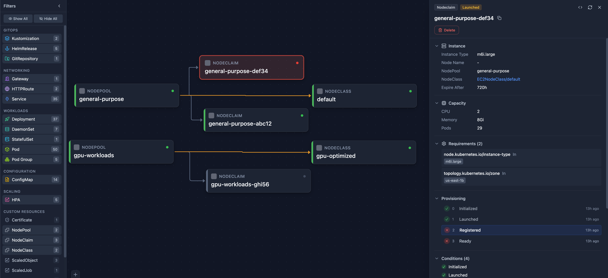
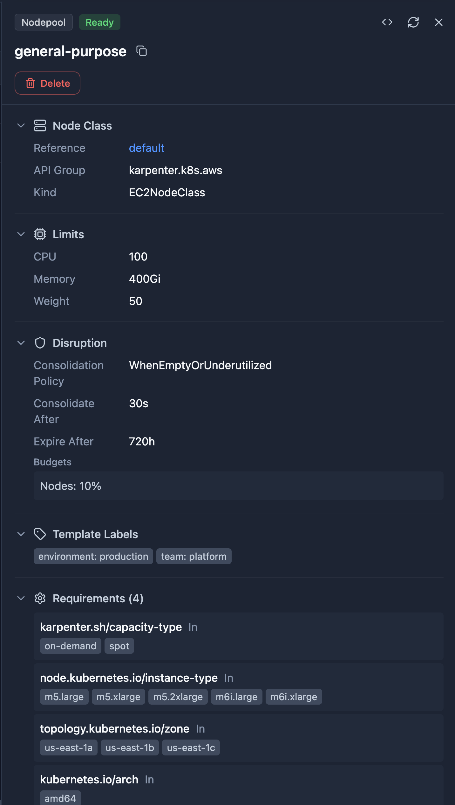
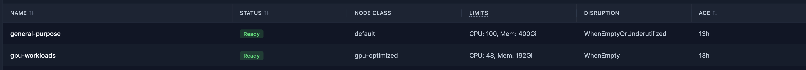
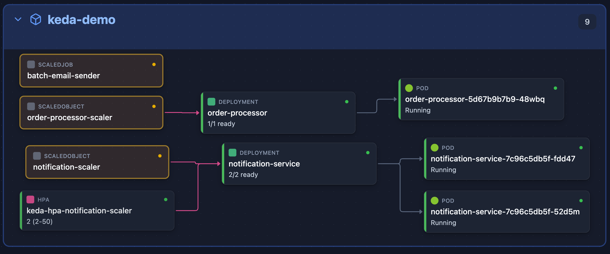
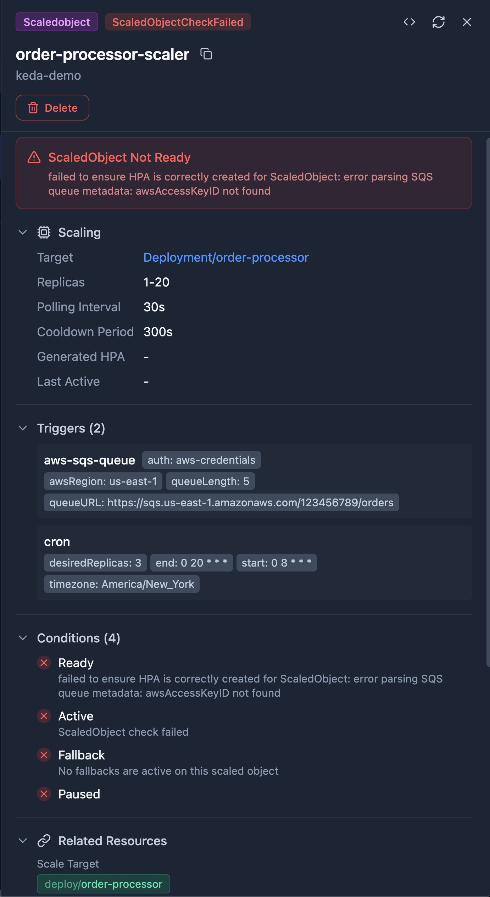
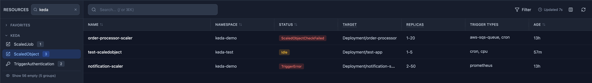
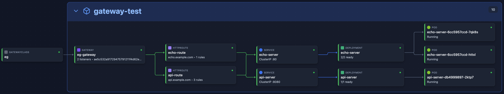
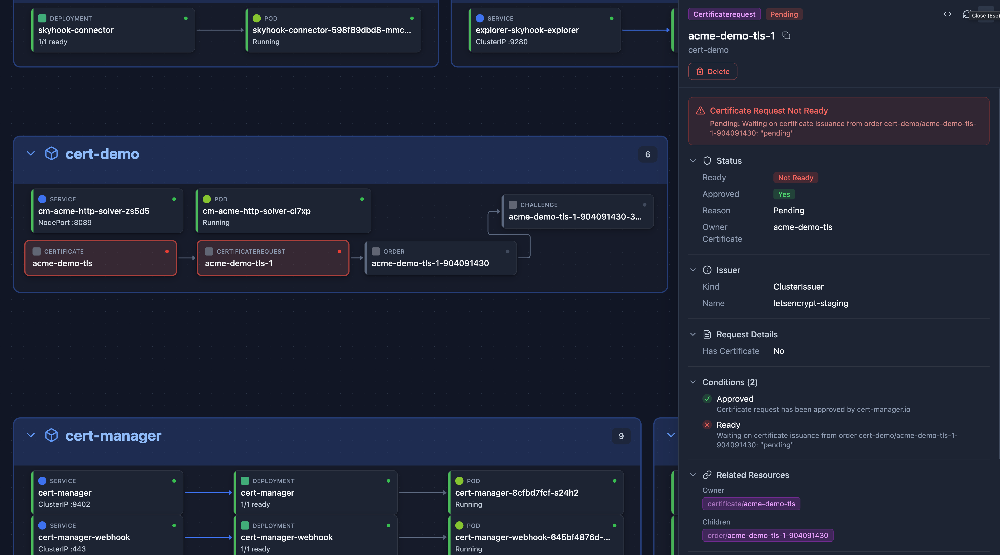
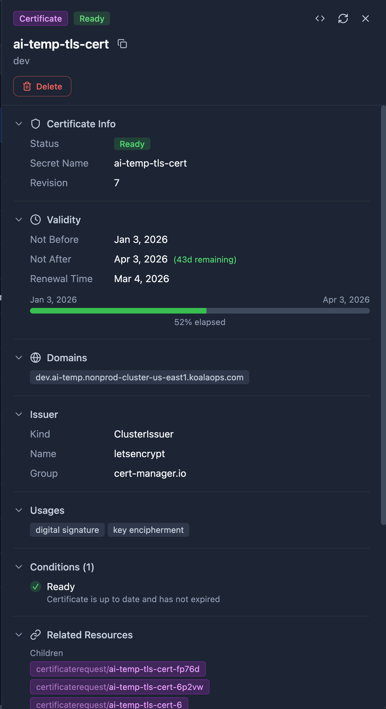
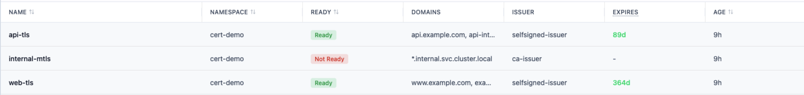

# CRD Integrations

Radar automatically discovers and displays **any** Custom Resource Definition (CRD) in your cluster — no configuration needed. For popular tools, Radar provides dedicated detail views, topology edges, smart table columns, and AI-optimized summaries for seamless integration.

---

## Karpenter

[Karpenter](https://karpenter.sh/) is the standard node autoscaler for Kubernetes, replacing Cluster Autoscaler on AWS (EKS), Azure (AKS NAP), and generic clusters.

### What Radar Shows

**Topology:** Full provisioning chain — NodePool → NodeClaim → Node → Pod. See which NodePool owns which NodeClaims, which Nodes they provisioned, and what Pods are running on them. NodePool → NodeClass edges show the provider-specific configuration each pool uses.

  
   <em>Karpenter in Topology View — NodePool → NodeClaim provisioning chain</em>

**NodePool Detail View:**
- Status conditions (Ready)
- Clickable NodeClass reference (EC2NodeClass, AKSNodeClass, or generic)
- Resource limits (CPU, memory)
- Disruption policy and consolidation settings
- Instance requirements (types, zones, architectures)
- Template labels applied to provisioned nodes

  
   <em>NodePool Detail View — Status, related NodeClaims, and full specification</em>

**NodeClaim Detail View:**
- Provisioning timeline with timestamps
- Status conditions (Initialized, Launched, Registered, Ready)
- Instance type, capacity, and zone
- Requirements (instance types, architectures, OS)
- Clickable Node and NodeClass references

**NodeClass Detail View** (EC2NodeClass, AKSNodeClass, etc.):
- AMI selector terms and aliases
- Block device mappings (volume type, size, encryption)
- IAM role configuration
- Subnet and security group discovery tags
- Instance metadata options (IMDS configuration)

**Resource Browser:** Smart columns show status, NodeClass reference, limits, and disruption policy at a glance.

  
   <em>NodePool Resource Browser — Status, NodeClass, limits, and disruption policy at a glance</em>

### Supported CRDs

| CRD | Group | Topology | Detail View | AI Summary |
|-----|-------|----------|-------------|------------|
| NodePool | `karpenter.sh/v1` | Yes | Yes | Yes |
| NodeClaim | `karpenter.sh/v1` | Yes | Yes | Yes |
| EC2NodeClass | `karpenter.k8s.aws/v1` | Yes | Yes | Yes |
| AKSNodeClass | `karpenter.azure.com/v1alpha2` | Yes | Yes | Yes |

All provider-specific NodeClass variants are automatically detected and supported.

---

## KEDA

[KEDA](https://keda.sh/) (Kubernetes Event-Driven Autoscaling) is a CNCF graduated project that scales workloads based on external event sources — queues, streams, cron schedules, Prometheus metrics, and 60+ other triggers.

### What Radar Shows

**Topology:** ScaledObject → target workload (Deployment, StatefulSet, or Rollout). See which workloads are managed by KEDA and trace the scaling relationship.

  
   <em>KEDA in Topology View — ScaledObject → Deployment → Pod scaling chain</em>

**ScaledObject Detail View:**
- Status conditions (Ready, Active, Paused, Fallback)
- Target workload reference
- Min/Max/Idle replica configuration
- Polling interval and cooldown period
- Trigger list with type and metadata
- Generated HPA name
- Pause state detection (supports all 3 annotation variants)

  
   <em>ScaledObject Detail View — Status conditions, target workload, triggers, and replica configuration</em>

**ScaledJob Detail View:**
- Status conditions
- Job target reference
- Scaling strategy (default, custom, accurate, eager)
- Success/failure limits
- Trigger list

**TriggerAuthentication Detail View:**
- Pod identity provider and configuration
- Secret references with linked Secret navigation
- Environment variable mappings
- External secret providers (HashiCorp Vault, Azure Key Vault, AWS Secrets Manager)

**Resource Browser:** Smart columns show status, target workload, trigger count, and replica range at a glance.

  
   <em>ScaledObject Resource Browser — Status, target workload, trigger count, and replica range</em>

### Supported CRDs

| CRD | Group | Topology | Detail View | AI Summary |
|-----|-------|----------|-------------|------------|
| ScaledObject | `keda.sh/v1alpha1` | Yes | Yes | Yes |
| ScaledJob | `keda.sh/v1alpha1` | Yes | Yes | Yes |
| TriggerAuthentication | `keda.sh/v1alpha1` | — | Yes | Yes |
| ClusterTriggerAuthentication | `keda.sh/v1alpha1` | — | Yes | Yes |

---

## Gateway API

[Gateway API](https://gateway-api.sigs.k8s.io/) is the next-generation Kubernetes networking API, replacing Ingress with more expressive routing, traffic splitting, and multi-tenant support.

### What Radar Shows

**Topology:** Full network path — GatewayClass → Gateway → HTTPRoute/GRPCRoute/TCPRoute/TLSRoute → Service → Pod. Visualize how traffic flows from the gateway controller through routes to your backend services.

  
   <em>Gateway API in Topology View — GatewayClass → Gateway → HTTPRoute → Service traffic path</em>

**Gateway Detail View:** Listeners, addresses, attached routes, and status conditions.

**GatewayClass Detail View:** Controller name, description, parameters reference, and status conditions.

**HTTPRoute Detail View:** Rules with path/header matching, backend references, filters, and weights.

**GRPCRoute Detail View:** Service/method matching, backend references, and filters.

### Supported CRDs

| CRD | Group | Topology | Detail View | AI Summary |
|-----|-------|----------|-------------|------------|
| GatewayClass | `gateway.networking.k8s.io/v1` | Yes | Yes | Yes |
| Gateway | `gateway.networking.k8s.io/v1` | Yes | Yes | Yes |
| HTTPRoute | `gateway.networking.k8s.io/v1` | Yes | Yes | Yes |
| GRPCRoute | `gateway.networking.k8s.io/v1` | Yes | Yes | Yes |
| TCPRoute | `gateway.networking.k8s.io/v1alpha2` | Yes | Yes | Yes |
| TLSRoute | `gateway.networking.k8s.io/v1alpha2` | Yes | Yes | Yes |

---

## cert-manager

[cert-manager](https://cert-manager.io/) automates TLS certificate management — issuing, renewing, and revoking certificates from Let's Encrypt, Vault, Venafi, and other issuers.

### What Radar Shows

**Topology:** Certificate → Issuer/ClusterIssuer edges show which issuer manages each certificate. The full provisioning chain (Certificate → CertificateRequest → Order → Challenge) is connected via owner references.

  
   <em>cert-manager in Topology View — Certificate → CertificateRequest provisioning chain</em>

**Certificate Detail View:**
- Status conditions (Ready) with color-coded expiry warnings
- Validity period with progress bar (green → yellow → red as expiry approaches)
- Subject, DNS names, issuer reference
- Renewal time and last failure

**Dashboard:** Certificate health card showing healthy/warning/critical/expired certificate counts across all namespaces.

**TLS Secret Parsing:** Click any TLS Secret to see the X.509 certificate details — subject, issuer, validity dates, SANs — parsed directly from the secret data.

  
   <em>Certificate Detail View — Validity progress bar, DNS names, issuer reference, and status conditions</em>

  
   <em>Certificate Resource Browser — Ready status, domains, issuer, and expiry date at a glance</em>

### Supported CRDs

| CRD | Group | Topology | Detail View | AI Summary |
|-----|-------|----------|-------------|------------|
| Certificate | `cert-manager.io/v1` | Yes | Yes | — |
| CertificateRequest | `cert-manager.io/v1` | Yes | Yes | — |
| Issuer | `cert-manager.io/v1` | Yes | Yes | — |
| ClusterIssuer | `cert-manager.io/v1` | Yes | Yes | — |
| Order | `acme.cert-manager.io/v1` | Yes | Yes | — |
| Challenge | `acme.cert-manager.io/v1` | Yes | Yes | — |

---

## Trivy Operator

[Trivy Operator](https://aquasecurity.github.io/trivy-operator/) continuously scans your cluster for vulnerabilities, misconfigurations, exposed secrets, and license compliance issues.

### What Radar Shows

**VulnerabilityReport Detail View:** Severity breakdown (Critical/High/Medium/Low), affected images, and CVE counts.

**ConfigAuditReport Detail View:** Pass/fail checks with severity levels.

**Resource Browser:** Smart columns show severity counts and scan status at a glance.

### Supported CRDs

| CRD | Group | Topology | Detail View | AI Summary |
|-----|-------|----------|-------------|------------|
| VulnerabilityReport | `aquasecurity.github.io/v1alpha1` | — | Yes | — |
| ConfigAuditReport | `aquasecurity.github.io/v1alpha1` | — | Yes | — |
| ExposedSecretReport | `aquasecurity.github.io/v1alpha1` | — | Yes | — |
| ClusterComplianceReport | `aquasecurity.github.io/v1alpha1` | — | Yes | — |
| SbomReport | `aquasecurity.github.io/v1alpha1` | — | Yes | — |

---

## Bitnami Sealed Secrets

[Sealed Secrets](https://sealed-secrets.netlify.app/) encrypts Kubernetes Secrets so they can be safely stored in Git. The controller decrypts them in-cluster at deploy time.

### What Radar Shows

**SealedSecret Detail View:** Encrypted data keys, template metadata, and the target Secret's scope and namespace.

### Supported CRDs

| CRD | Group | Topology | Detail View | AI Summary |
|-----|-------|----------|-------------|------------|
| SealedSecret | `bitnami.com/v1alpha1` | — | Yes | — |

---

## GitOps

See the main [README](../README.md#gitops) for GitOps integration details.

### FluxCD

| CRD | Group | Topology | Detail View | AI Summary |
|-----|-------|----------|-------------|------------|
| GitRepository | `source.toolkit.fluxcd.io/v1` | Yes | Yes | Yes |
| OCIRepository | `source.toolkit.fluxcd.io/v1beta2` | Yes | Yes | — |
| HelmRepository | `source.toolkit.fluxcd.io/v1` | Yes | Yes | — |
| Kustomization | `kustomize.toolkit.fluxcd.io/v1` | Yes | Yes | Yes |
| HelmRelease | `helm.toolkit.fluxcd.io/v2` | Yes | Yes | Yes |
| Alert | `notification.toolkit.fluxcd.io/v1beta3` | — | Yes | — |

### ArgoCD

| CRD | Group | Topology | Detail View | AI Summary |
|-----|-------|----------|-------------|------------|
| Application | `argoproj.io/v1alpha1` | Yes | Yes | Yes |
| ApplicationSet | `argoproj.io/v1alpha1` | — | Generic | — |
| AppProject | `argoproj.io/v1alpha1` | — | Generic | — |

---

## Argo Rollouts

[Argo Rollouts](https://argoproj.github.io/rollouts/) provides progressive delivery strategies including blue-green and canary deployments.

| CRD | Group | Topology | Detail View | AI Summary |
|-----|-------|----------|-------------|------------|
| Rollout | `argoproj.io/v1alpha1` | Yes | Yes | Yes |

---

## Argo Workflows

[Argo Workflows](https://argoproj.github.io/workflows/) is a container-native workflow engine for orchestrating parallel jobs on Kubernetes.

| CRD | Group | Topology | Detail View | AI Summary |
|-----|-------|----------|-------------|------------|
| Workflow | `argoproj.io/v1alpha1` | — | Yes | — |
| WorkflowTemplate | `argoproj.io/v1alpha1` | — | Yes | — |

---

## Any Other CRD

Radar automatically discovers and displays **every** CRD installed in your cluster — no configuration or plugins required. Resources appear in the sidebar, can be filtered and searched, and show full YAML with syntax highlighting in the detail drawer. The integrations above add richer presentation, but every CRD is browsable out of the box.
